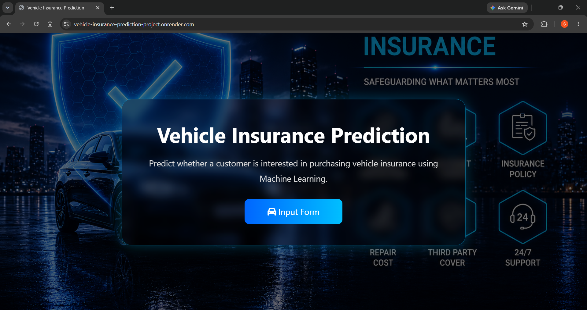
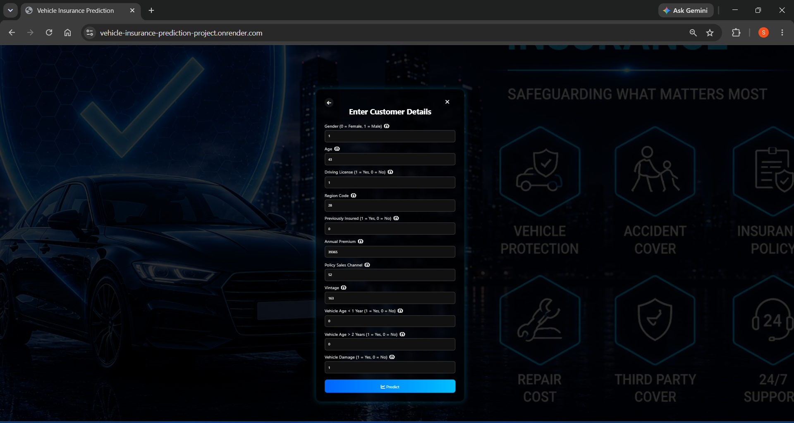
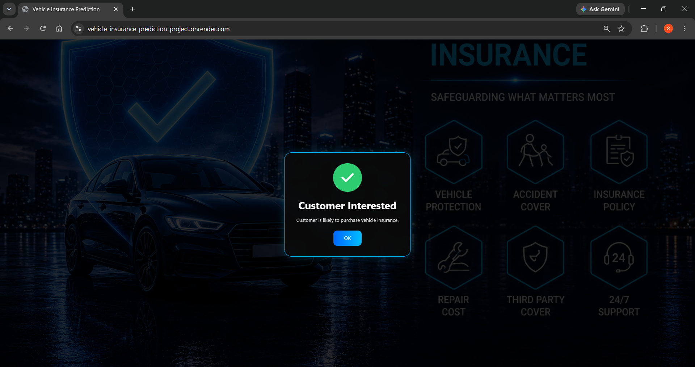
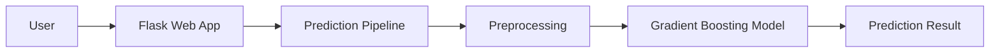
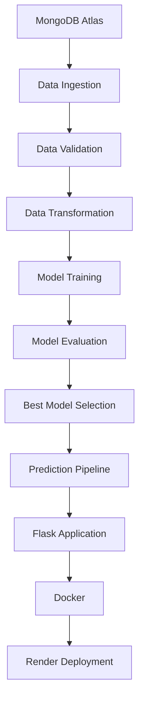

# 🚗 Vehicle Insurance Prediction | End-to-End MLOps Project

<p align="center">


</p>

An end-to-end MLOps project that automates the complete machine learning lifecycle—from MongoDB data ingestion and model training to Dockerized deployment with CI/CD and cloud hosting on Render.

## 🌐 Live Demo


**🔗 Application:** [Live Demo](https://vehicle-insurance-prediction-project.onrender.com)

**📂 Repository:** [GitHub Repository](https://github.com/sandeep5268/Vehicle-Insurance-Prediction-Project)

---

## 🎥 Project Demo

<p align="center">
    
</p>

<p align="center">
    <b>End-to-End Insurance Prediction Workflow:</b>
    User Input → Data Preprocessing → Model Prediction → Result Display
</p>

## 📑 Table of Contents

- [Project Overview](#-project-overview)
- [Business Problem](#-business-problem)
- [Dataset](#-dataset)
- [Key Features](#-key-features)
- [Technology Stack](#️-technology-stack)
- [Model Performance](#-model-performance)
- [End-to-End MLOps Workflow](#-end-to-end-mlops-workflow)
- [Project Components](#-project-components)
- [Project Structure](#-project-structure)
- [Quick Start](#-quick-start)
- [Docker](#-docker-containerization)
- [CI/CD](#-cicd-pipeline)
- [Deployment](#️-deployment)
- [Future Enhancements](#-future-enhancements)

---

## 📖 Project Overview

This project is a complete **MLOps implementation for Vehicle Insurance Prediction**, designed to automate the entire Machine Learning lifecycle from data ingestion to production deployment.

The system predicts whether a customer is likely to purchase vehicle insurance based on demographic and vehicle-related information.

The project follows industry-standard MLOps practices including:

* Automated Data Ingestion
* Data Validation
* Feature Engineering
* Data Transformation
* Model Training
* Model Evaluation
* Best Model Selection
* Prediction Pipeline
* Docker Containerization
* CI/CD Automation
* Cloud Deployment

---

## 🎯 Business Problem

Insurance companies spend significant resources targeting customers who may not be interested in vehicle insurance.

This project helps organizations:

* Improve marketing efficiency
* Reduce customer acquisition costs
* Identify high-potential customers
* Increase conversion rates
* Enable data-driven decision making

using Machine Learning predictions.

## 📂 Dataset

The model is trained using a vehicle insurance dataset containing customer demographic, vehicle, and insurance-related information.

### Dataset Summary

- **Source:** Kaggle Vehicle Insurance Dataset
- **Task:** Binary Classification
- **Target Variable:** `Response`

### Input Features

- Gender
- Age
- Driving License
- Region Code
- Previously Insured
- Vehicle Age
- Vehicle Damage
- Annual Premium
- Policy Sales Channel
- Vintage

### Target Classes

- **0** → Customer is **not interested** in vehicle insurance.
- **1** → Customer **is interested** in vehicle insurance.

## ⚡ Key Features

### Data Engineering

✔ MongoDB Atlas Integration

✔ Automated Data Ingestion Pipeline

✔ Data Validation Framework

✔ Schema-Based Validation

---

### Machine Learning

✔ Feature Engineering Pipeline

✔ Data Transformation Pipeline

✔ Multiple Model Training

✔ Model Comparison

✔ Best Model Selection

✔ Prediction Pipeline

---

### MLOps

✔ Modular Project Structure

✔ Artifact Management

✔ Custom Logging Framework

✔ Custom Exception Handling

✔ Model Versioning Strategy

---

### DevOps & Deployment

✔ Docker Containerization

✔ GitHub Actions CI/CD

✔ Cloud Deployment on Render

✔ Production Ready Architecture

---

## 📸 Application Screenshots

### 🏠 Home Page

<p align="center">
    
</p>

### 🎯 Prediction Workflow

The following screenshots show the customer inputs and the generated insurance prediction

<table>
    <tr>
        <td align="center">
            
            <br>
            <b>Input Features</b>
        </td>
        <td align="center">
            
            <br>
            <b>Prediction Result</b>
        </td>
    </tr>
</table>

## ⚙️ Technology Stack

### Programming Language

* Python 3.12

### Database

* MongoDB Atlas

### Data Processing

* Pandas
* NumPy

### Machine Learning

* Scikit-Learn

### Visualization

* Matplotlib
* Seaborn

### MLOps

* Custom ML Pipeline
* Artifact Tracking
* Model Evaluation Framework
* Prediction Pipeline

### DevOps

* Docker
* GitHub Actions

### Deployment

* Render

---

## 🏗️ System Architecture



## 📊 Model Performance

The project evaluates multiple machine learning algorithms and automatically selects the best-performing model based on evaluation metrics.

### Models Evaluated

* Random Forest Classifier
* Gradient Boosting Classifier
* XGBoost Classifier

### Model Comparison

|             Model            |  Precision |  Recall | F1 Score  |  Accuracy |
|------------------------------|------------|---------|-----------|-----------|
| Gradient Boosting Classifier |  89.012%   | 97.418% |  93.026%  |  92.307%  |
| Random Forest Classifier     |  86.477%   | 98.439% |  92.027%  |  91.065%  |
| XGBoost Classifier           |  88.105%   | 97.400% |  92.520%  |  91.700%  |

### Best Model

|        Model       | GradientBoostingClassifier |
|--------------------|----------------------------|
| selection strategy |      Highest F1 score      |

### Evaluation Metrics

| Metric    |  Score  |
| --------- | ------- |
| F1 Score  | 93.026% |
| Accuracy  | 92.307% |
| Precision | 89.012% |
| Recall    | 97.418% |


### Model Selection Strategy

The model with the highest performance on the validation dataset is selected and saved for production inference.

### Final Production Model

GradientBoostingClassifier was selected for deployment because it achieved the highest F1 Score while maintaining excellent Precision, Accuracy, and Recall.

## 🔄 End-to-End MLOps Workflow



---

## 🧠 Project Components

### 1️⃣ Data Ingestion

Responsible for fetching data from MongoDB Atlas and converting it into DataFrames for downstream processing.

#### Features

* MongoDB Connection Management
* Automated Data Collection
* Artifact Generation

---

### 2️⃣ Data Validation

Validates dataset quality before moving to transformation and training.

#### Validation Checks

* Schema Validation
* Missing Columns Detection
* Data Type Verification
* Dataset Integrity Checks

---

### 3️⃣ Data Transformation

Transforms raw data into machine-learning-ready features.

#### Operations

* Missing Value Handling
* Feature Encoding
* Feature Scaling
* Preprocessing Pipeline Creation

---

### 4️⃣ Model Training

Trains multiple machine learning models and selects the best-performing model.

#### Features

* Multiple Algorithms
* Hyperparameter Optimization
* Performance Evaluation

---

### 5️⃣ Model Evaluation

Compares newly trained models against previously saved production models.

#### Features

* Model Comparison
* Threshold-Based Selection
* Best Model Preservation

---

### 6️⃣ Prediction Pipeline

Provides real-time predictions through the deployed web application.

#### Features

* Input Processing
* Data Transformation
* Model Loading
* Prediction Generation

---

## 📁 Project Structure

```text
Vehicle-Insurance-Prediction-Project/
│
├── artifacts/
├── notebook/
├── saved_models/
│
├── src/
│   ├── components/
│   │   ├── data_ingestion.py
│   │   ├── data_validation.py
│   │   ├── data_transformation.py
│   │   ├── model_trainer.py
│   │   └── model_evaluation.py
│   │
│   ├── configuration/
│   ├── data_access/
│   ├── entity/
│   ├── exception/
│   ├── logger/
│   ├── pipeline/
│   └── utils/
│
├── static/
├── templates/
│
├── app.py
├── demo.py
├── Dockerfile
├── requirements.txt
├── setup.py
├── pyproject.toml
└── README.md
```

## 🚀 Quick Start

### Prerequisites

- Python 3.12
- Conda
- Git
- MongoDB Atlas Account

### 1️⃣ Clone Repository

```bash
git clone https://github.com/sandeep5268/Vehicle-Insurance-Prediction-Project.git

cd Vehicle-Insurance-Prediction-Project
```

### 2️⃣ Create Conda Environment

```bash
conda create -n vehicle_insurance python=3.12 -y
```

### 3️⃣ Activate Environment

```bash
conda activate vehicle_insurance
```

### 4️⃣ Install Dependencies

```bash
pip install -r requirements.txt
```

### 5️⃣ Configure Environment Variables

Create a `.env` file and add:

```env
MONGODB_URL=your_mongodb_connection_string
```

### 6️⃣ Run Application

```bash
python app.py
```

### 7️⃣ Open Browser

```text
http://localhost:5000
```

---

## 📝 Logging & Exception Handling

### Logging Framework

Tracks:

* Pipeline Execution
* Training Progress
* Component Activities
* Deployment Diagnostics

---

### Custom Exception Framework

Provides:

* Detailed Traceback Information
* Easier Debugging
* Production-Ready Error Handling

---

## 🐳 Docker Containerization

### Build Docker Image

```bash
docker build -t vehicle-insurance-prediction-project .
```

### Run Docker Container

```bash
docker run -p 5000:5000 vehicle-insurance-prediction-project
```

### Run with MongoDB URL

```bash
docker run \
-e MONGODB_URL="<mongodb_connection_string>" \
-p 5000:5000 \
vehicle-insurance
```

---

## ⚡ CI/CD Pipeline

The project uses GitHub Actions to automate:

* Build Validation
* Dependency Installation
* Docker Build
* Deployment Workflow

### Workflow

```text
Code Push
    │
    ▼
GitHub Actions
    │
    ▼
Build & Test
    │
    ▼
Docker Build
    │
    ▼
Deployment
```

---
## Deployment

The application is deployed on Render

### Live Application
https://vehicle-insurance-prediction-project.onrender.com

---

## 🚀 Future Enhancements

* MLflow Integration
* Model Monitoring
* Data Drift Detection
* Automated Retraining
* Kubernetes Deployment
* AWS ECR Integration
* AWS EC2 Deployment
* Feature Store Implementation

---

## 📄 License

This project is licensed under the MIT License.


## 👨‍💻 Author

### Sandeep Gotukula

Machine Learning Engineer | MLOps Enthusiast

### Connect With Me

- LinkedIn: [Sandeep Gotukula](https://www.linkedin.com/in/sandeep-gotukula)
- GitHub: [sandeep5268](https://github.com/sandeep5268)

---

## ⭐ Support

If you found this project helpful, please consider giving it a **Star ⭐** on GitHub.

It helps increase visibility and motivates further improvements.
